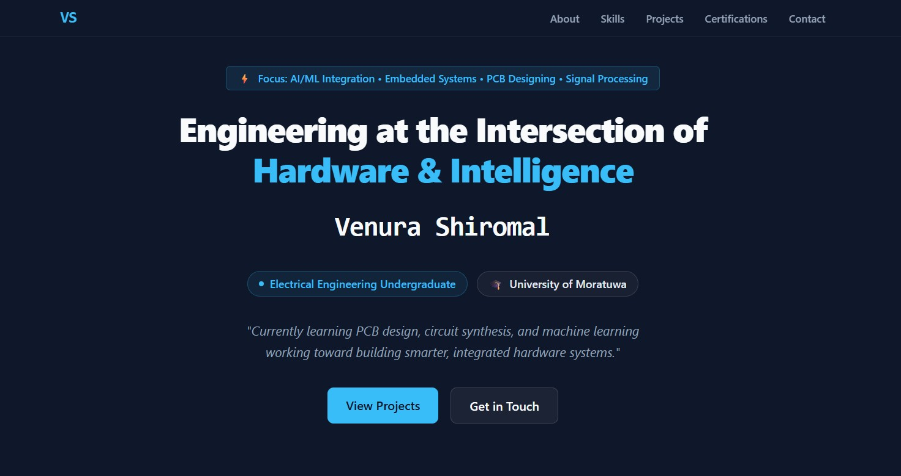

# 🚀 Personal Portfolio Website

[](https://venura-shiromal.pages.dev)
[](https://github.com/Venura-Shiromal/Venura-Shiromal-Site)

> My personal portfolio website showcasing my journey as an Electrical Engineering undergraduate.

---

## ✨ Features

- **Main Section** — Dynamic typewriter effect with focus badge
- **Projects** — Interactive cards with project previews and tech tags
- **Skills** — Categorized tech stack grid (Programming, Hardware, AI/ML, Embedded, Signal Processing)
- **Certifications** — Course cards with descriptions and status badges
- **Contact** — Glass-morphism form with direct email fallback
- **Navigation** — Sticky navbar with smooth scrolling and mobile hamburger menu
- **Responsive** — Fully optimized for all screen sizes

---

## 🛠️ Tech Stack

| Category | Technologies |
| :--- | :--- |
| **Frontend** | HTML5, CSS3 |
| **Styling** | Custom CSS, Glass-morphism, Flexbox, CSS Grid |
| **Fonts** | Google Fonts (JetBrains Mono) |
| **Hosting** | Cloudflare Pages |

---

## 📂 Project Structure

```tree
├── index.html          # Main HTML file           # All custom styles
├── projects/           # Projects Page
├── styles/             # Cascade Script Styles
├── media/              # Images and assets
│   └── projects/       # Project preview images
|   LICENSE             # License file
└── README.md           # This file

```

---

## 📸 Preview



---

## 🎨 Color Palette

| Color | Hex Code | Usage |
| :--- | :--- | :--- |
| Dark Background | `#0f172a` | Main background |
| Surface | `#1e293b` | Cards and containers |
| Primary Accent | `#38bdf8` | Buttons, links, highlights |
| Light Text | `#f8fafc` | Headings |
| Muted Text | `#94a3b8` | Body text and descriptions |

---


## 📬 Contact

- **Email**: [gamersart2020@gmail.com](mailto:gamersart2020@gmail.com)
- **GitHub**: [github.com/your-username](https://github.com/venura-shiromal)
- **LinkedIn**: [linkedin.com/in/your-profile](https://www.linkedin.com/in/venura-shiromal-697313330/)

---

## 📝 License

This project is open source and available under the [MIT License](LICENSE).

---

## 🙏 Acknowledgments

- [Formspree](https://formspree.io/) — Contact form backend
- [Google Fonts](https://fonts.google.com/) — JetBrains Mono
- Inspired by modern developer portfolios and engineering aesthetics

---

**Built with ❤️ using HTML & CSS**
